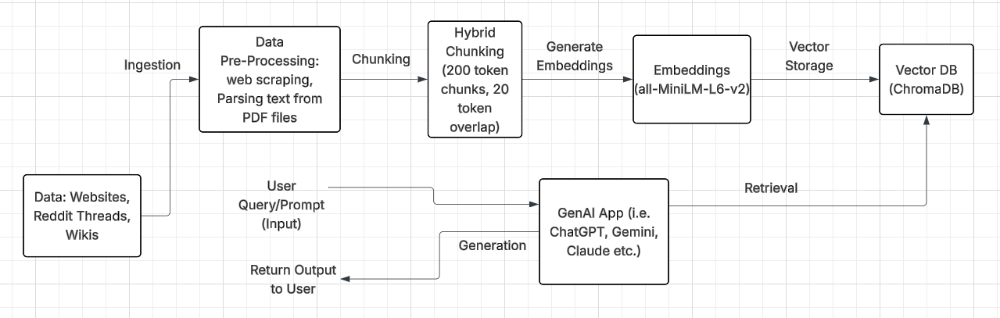

# Project 1 Planning: The Unofficial Guide

> Write this document before you write any pipeline code.
> Your spec and architecture diagram are what you'll use to direct AI tools (Claude, Copilot, etc.) to generate your implementation — the more specific they are, the more useful the generated code will be.
> Update the Retrieval Approach and Chunking Strategy sections if you change your approach during implementation.
> Update this file before starting any stretch features.

---

## Domain

<!-- What domain did you choose? Why is this knowledge valuable and hard to find through official channels? -->
Domain: Student reviews for the OMSCS program at Georgia Tech. The information is valuable because there is no one-stop shop for incoming and current OMS students to find information on selecting courses for the program. Instead of searching YouTube reviews, Reddit Threads, OMS Reviews, and OMSHub separately, we can access the materials through one RAG chatbot. 

---

## Documents

<!-- List your specific sources: URLs, subreddit names, forum threads, or file descriptions.
     Aim for at least 10 sources that together cover different subtopics or perspectives within your domain. -->

| # | Source | Description | URL or location |
|---|--------|-------------|-----------------|
| 1 | OMS Reviews | Reviews for OMS Classes at Georgia Tech |https://www.omscentral.com|
| 2 | omscs.rocks | Student-Run Sheet that details capacity of OMS courses previous semesters | https://docs.google.com/spreadsheets/d/e/2PACX-1vRyHrRhH2V52bsYFEtm-8oJDaFOlyGYz6AKXm8WwsthN3fNP3KGkEx7O7D9ZHV3j2iKnzU2XHqoh4pQ/pubhtml |
| 3 | Course & Specs Megathread - Selection, Choices & Registration | Reddit Thread to help OMSCS students navigate course selection | https://www.reddit.com/r/OMSCS/comments/1pyef5z/course_specs_megathread_selection_choices/ |
| 4 | Courses Ranked by Difficulty Spring/Fall 2025 | List of OMS Classes Categorized by Difficulty in Spring and Fall Semesters 2025 | https://www.reddit.com/r/OMSCS/comments/1hsbc76/all_courses_ranked_by_difficulty_2025_springfall/ |
| 5 | Courses Ranked by Difficulty Summer 2025 | List of OMS Classes Categorized by Difficulty in Summer Semester 2025 | https://www.reddit.com/r/OMSCS/comments/1k5k7av/all_courses_ranked_by_difficulty_2025_summer/ |
| 6 | Workload Distributions | Course Workload Distribution for OMS Courses from 2021 - 2024 | https://www.reddit.com/r/OMSCS/comments/1dd0snd/all_courses_workload_distributions_table/ |
| 7 | OMSHub | Wiki of Course Reviews and Ratings for OMS programs | https://www.omshub.org |
| 8 | Specialization in Machine Learning | Requirements and Course Options for OMSCS students interested in pursuing Machine Learning Specialization | https://omscs.gatech.edu/specialization-machine-learning |
| 9 | Specialization in Artificial Intelligence | Requirements and Course Options for OMSCS students interested in specializing in Artifical Intelligence | https://omscs.gatech.edu/specialization-artificial-intelligence-formerly-interactive-intelligence |
| 10 | Specialization in Human-Computer Interaction | Requirements and Course Options for OMSCS students interested in selecting Human-Computer Interaction for their specialization | https://omscs.gatech.edu/specialization-human-computer-interaction |
| 11 | Specialization in Computational Perception and Robotics | Requirements and Course Options for OMSCS students interested in choosing Computational Perception and Robotics as their specialization | https://omscs.gatech.edu/specialization-computational-perception-and-robotics |
| 12 | Specialization in Computing Systems | Requirements and Course Options for OMSCS students interested in studying Computing Systems | https://omscs.gatech.edu/specialization-computing-systems |
| 13 | Specialization in Computer Graphics | Requirements and Course Options for OMSCS students opting to specialize in Computer Graphics | https://omscs.gatech.edu/specialization-computer-graphics |

---

## Chunking Strategy

<!-- How will you split documents into chunks?
     State your chunk size (in tokens or characters), overlap size, and explain why those
     numbers fit the structure of your documents.
     A review-heavy corpus warrants different chunking than a long FAQ. -->
Hybrid Chunking 

**Chunk size:** 500 tokens

**Overlap:** 50 tokens

**Reasoning:** Experimenting for now (multiples of 5 and 10)

---

## Retrieval Approach

<!-- Which embedding model are you using (e.g., all-MiniLM-L6-v2 via sentence-transformers)?
     How many chunks will you retrieve per query (top-k)?
     If you were deploying this for real users and cost wasn't a constraint, what tradeoffs
     would you weigh in choosing a different embedding model — context length, multilingual
     support, accuracy on domain-specific text, latency? -->

**Embedding model:**  all-MiniLM-L6-v2

**Top-k:** 5

**Production tradeoff reflection:** Accuracy and precision on keywords (course numbers and information) that reflect sentiment of OMSCS class reviews.

---

## Evaluation Plan

<!-- List your 5 test questions with their expected correct answers.
     Questions should be specific enough that you can judge whether the system's response
     is right or wrong. "What are good dining halls?" is too vague.
     "What do students say about wait times at [dining hall name] during lunch?" is testable. -->

| # | Question | Expected answer |
|---|----------|-----------------|
| 1 | Please give me a list of medium-level courses to take for the human-computer interaction specialization in fall/spring semesters. | CS 6750: Human-Computer Interaction |
| 2 | Please give me a list of easy-level courses to take for computing systems. | CS 6250: Computer Networks, CS 6310: Software Architecture and Design, and CS 6422: Database System Implementation|
| 3 | What are some of the hardest courses in the OMSCS program? | CSE 6620: Intro to High-Computing, CS 6211: System Design for Cloud Computing, CS 6476: Computer Vision, CS 7210: Distributed Computing, CS 6475: Computational Photography, CS 8803 O08: Compilers - Theory and Practice |
| 4 | What are the core classes for the Computer Graphics specialization? | CS 6491: Foundations of Computer Graphics, CS 6457: Video Game Design, CS 7496: Computer Animation, CS 6505 Computability, Algorithms, and Complexity, CS 6515 Introduction to Graduate Algorithms. Please note that CS 6505 is only avaliable to students on-campus because the course is not bolded on the website.|
| 5 | What are the elective options for Machine Learning? | CS 6220 Big Data Systems & Analysis, CS 6476 Computer Vision, CS 6603 AI, Ethics, and Society, CS 7280 Network Science, CS 7535 Markov Chain Monte Carlo, CS 7540 Spectral Algorithms, CS 7545 Machine Learning Theory, CS 7616 Pattern Recognition, CS 7626 Behavioral Imaging, CS 7642 Reinforcement Learning and Decision Making (Formerly CS 8803-O03), CS 7643 Deep Learning, CS 7644 Machine Learning for Robotics, CS 7646 Machine Learning for Trading, CS 7650 Natural Language, CS 8803 Special Topics: Probabilistic Graph Models, CSE 6240 Web Search and Text Mining, CSE 6242 Data and Visual Analytics, CSE 6250 Big Data for Health (Formerly CSE 8803), ISYE 6416 Computational Statistics, ISYE 6420 Bayesian Methods, ISYE 6664 Stochastic Optimization |

---

## Anticipated Challenges

<!-- What could go wrong? Name at least two specific risks with reasoning.
     Consider: noisy or inconsistent documents, missing source attribution, off-topic
     retrieval, chunks that split key information across boundaries. -->

1. Inconsistency from reviews and documents
2. Chunking that splits information mid-sentence without giving the whole picture. 

---

## Architecture

<!-- Draw a diagram of your pipeline showing the five stages:
     Document Ingestion → Chunking → Embedding + Vector Store → Retrieval → Generation
     Label each stage with the tool or library you're using.
     You can use ASCII art, a Mermaid diagram, or embed a sketch as an image.
     You'll use this diagram as context when prompting AI tools to implement each stage. -->

     

---

## AI Tool Plan

<!-- For each part of the pipeline below, describe:
     - Which AI tool you plan to use (Claude, Copilot, ChatGPT, etc.)
     - What you'll give it as input (which sections of this planning.md, which requirements)
     - What you expect it to produce
     - How you'll verify the output matches your spec

     "I'll use AI to help me code" is not a plan.
     "I'll give Claude my Chunking Strategy section and ask it to implement chunk_text()
     with my specified chunk size and overlap" is a plan. -->

**Milestone 3 — Ingestion and chunking:** I will prompt Claude for pre-processing script to remove HTML tags, navigation menus, cookie banners, ads, footers, repeated site headers, "Read more" links, share buttons, comment counts, and any boilerplate that appears on every page. Manually, I will need to review the documents to check if they preserve the actual review text, opinions, ratings, descriptions, and any context needed to understand the content. 

**Milestone 4 — Embedding and retrieval:** I used LucidChart to establish my pipeline diagram to give to Claude along with the retrieval approach and evaluation plan from my planning.md file. 

**Milestone 5 — Generation and interface:** I prompted Claude to use the Gradio skeleton for the UI, include source attribution, and provid examples of desired grounded and non-grounded responses. 
